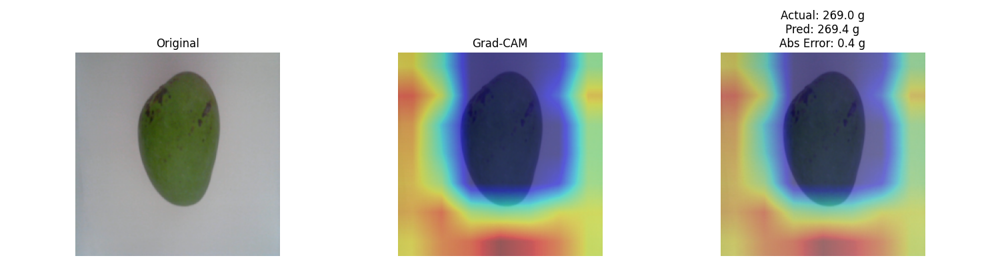
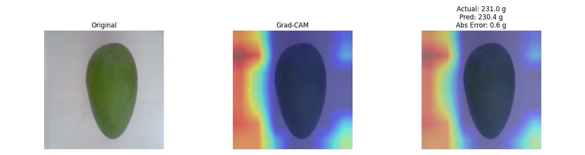
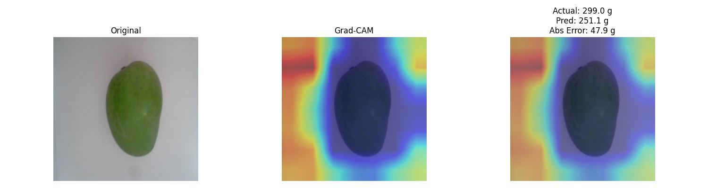
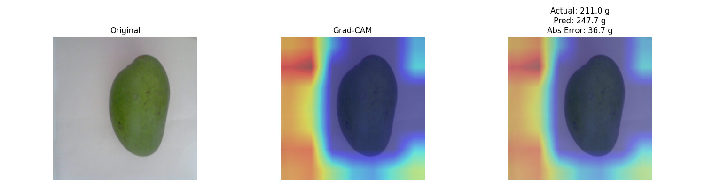

# mango-weight-estimation

Image-based mango weight estimation project using transfer learning and regression.

## Overview

This project explores whether the weight of Alphonso mangoes can be predicted from images using a pretrained CNN regression model.

To avoid data leakage, the dataset was split at the **sample level** rather than the image level, because each mango has two images. A structured-feature baseline was also built for comparison. The dataset consists of **71 mango samples and 142 images**.

## Dataset

**Dataset:** Alphonso Mangoes Image Dataset

Each sample includes:
- 2 images
- fruit diameter
- shoulder width
- actual weight

**Total:**
- 71 samples
- 142 images

In this project, the split was performed using **sample IDs**, so the two images of the same mango were always assigned to the same fold.

## Project Goal

The goal of this project was not only to train a CNN model, but also to compare different approaches on a small image regression dataset.

Main questions:
- Can mango weight be estimated from images alone?
- How does an image-based CNN compare with a structured-data baseline?
- What does the model attend to when predicting weight?

## Methods

### 1. Baseline

A baseline regression model was built using only structured features:
- fruit diameter
- shoulder width

Tested models:
- Linear Regression
- Ridge
- Random Forest Regressor

Among them, **Random Forest** performed best with approximately:
- **MAE:** 8.43
- **RMSE:** 10.56
- **R²:** 0.860

### 2. CNN Regression

For the image-based model:
- **Backbone:** ResNet18
- **Initialization:** ImageNet pretrained
- **Training strategy:** full fine-tuning
- **Validation:** 5-fold sample-level cross-validation

At first, image-only regression was unstable. After applying **target scaling** to the weight values, performance improved substantially.

Final full fine-tuning result:
- **MAE:** 23.52 g
- **RMSE:** 27.90 g
- **R²:** 0.158

### 3. Interpretability

Grad-CAM was used to analyze which regions the model attended to when predicting mango weight.

## Key Findings

- Structured numeric features outperformed the image-only CNN on this small dataset. The Random Forest baseline was clearly stronger than the ResNet18 regression model.
- Target scaling was important for stabilizing CNN regression training. Before scaling, validation error was extremely high; after scaling, performance improved substantially.
- Grad-CAM suggested that the CNN did not fully rely on the mango body itself. The attention maps appeared to react not only to the fruit region but also to background or boundary patterns, which may explain the limited performance.

## Grad-CAM Examples

### Well-predicted samples

| Sample | Visualization |
|---|---|
| Example 1 |  |
| Example 2 |  |

### Poorly-predicted samples

| Sample | Visualization |
|---|---|
| Example 1 |  |
| Example 2 |  |

These examples were included to compare where the model focused when the prediction was relatively accurate versus when the prediction error was larger.

## Why This Project Matters

This project is meaningful as a portfolio project because it goes beyond simply training a model.

It includes:
- leakage-aware validation design
- baseline vs deep learning comparison
- regression-specific training adjustments
- interpretability with Grad-CAM
- analysis of why a CNN may fail on a small dataset

Even though the CNN did not outperform the baseline, the project demonstrates practical experimentation, careful validation design, and result interpretation.

## Repository Structure

```text
mango-weight-estimation/
├── baseline.py
├── dataset.py
├── model.py
├── train.py
├── gradcam_utils.py
├── checkpoints/
├── assets/
│   ├── gradcam_good_1.png
│   ├── gradcam_good_2.png
│   ├── gradcam_bad_1.png
│   └── gradcam_bad_2.png
├── .gitignore
└── README.md
```
## How to Run

### Baseline
```bash
python baseline.py
```
### CNN Training
```bash
python train.py
```
### Grad-CAM Visualization
```bash
python gradcam_utils.py
```
## Future Improvements

Possible next steps:
- better background removal or object-centered cropping
- multimodal modeling using both images and numeric features
- additional regularization and learning-rate tuning
- more data for image-based regression

## Dataset Attribution

This project uses the **Alphonso Mangoes Image Dataset** published on Mendeley Data.

- **Dataset:** Alphonso Mangoes Image Dataset
- **DOI:** 10.17632/8sjny373pz.1
- **License:** CC BY 4.0

The Grad-CAM figures included in this repository are derived from the original dataset images and were modified for visualization purposes.

## One-Line Summary

A small-scale regression project that compares structured-feature baselines and image-based deep learning for mango weight estimation, while emphasizing leakage-free validation and model interpretability.
